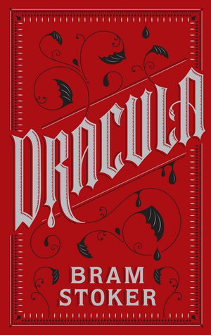

 

Published in 1987, Bram Stoker's *Dracula* is a Victorian-era epistolary novel about a Romanian vampire who plots to haunt the teeming population of industrial London but is thwarted when his vampiric assault on a well-connected lawyer, who assisted him in procuring property in London, and the best friend of his betrothed compels them to recruit an illustrious team of associates, under the leadership of the venerable Professor Abraham Van Helsing, that chase Dracula back to Romania and destroy him on the brink of his attempted escape. <!--more-->